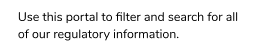
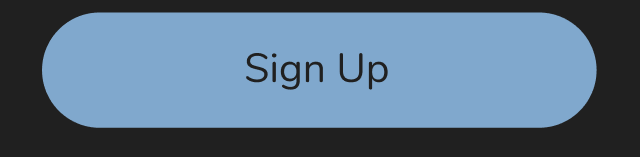
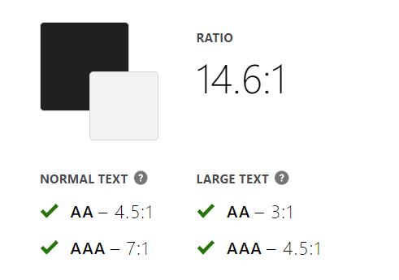
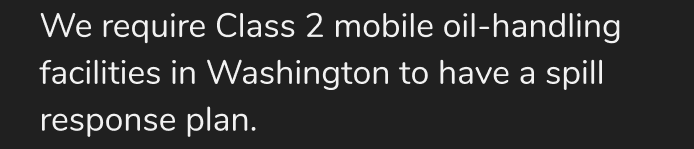
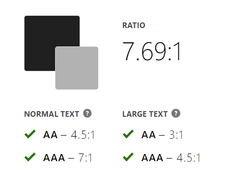
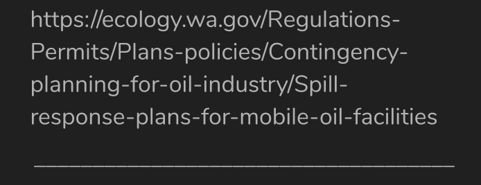

# Assignment 06: Interface Design
**Author:** Evelyn Hu  
**Course:** DH110 User Interface and Design  
**Description:** After constructing low-fidelity prototypes that model implementations of suggested features for the Washington State Department of Ecology website, I have now created wireframes on Figma. These wireframes are a draft of how the finished implementation may appear on the real website.

## Graphic Interface
The interface design was modeled after the preexisting Washington State Department of Ecology website. Many design choices were inspired by the design used in the original website, such as colors, font, and layout choices.  

This user interface design was created in Figma, which is a handy program for creating digitized wireframes. Many features allow the user to make different wireframes consistent, as the user can apply the same grids and layout colors to different frames. There are also multiple useful plugins, such as one that allows the user to check the contrast between two colors to ensure that the interface design is accessible.  

The full user interface system can be accessed on Figma [here](https://www.figma.com/file/c6cVkC289yL0i6vgz6hT72/DH110-Assignment-6-Interface-Design?node-id=0%3A1).  

## Wireflow
The low-fidelity prototype created prior to this interface design can be found [here](https://github.com/evelyn-s-hu/DH110-Assignment05-LowFidelityPrototype#readme).
For this project, I have only created the interface design of one of two proposed features (the regulations and permits user portal).

## Design
Light Mode  
  
  
  

Dark Mode  
  
  
  

### 1. Layout
Before beginning to design the user interface, the first step I did was to create a layout using grids as a reference for where elements should be placed on the screen. Using the grid overlay feature in Figma, I was able to ensure that no elements crossed into the margins, and was able to ensure there was enough spacing between elements so that the screens would not appear too crowded. Using a grid also allowed me to keep this consistent between different wireframes.  

### 2. System Design
When choosing the typeset for my system design, I wanted to choose something as close to the original website as possible, so that it would appear cohesively integrated into the Washington State Department of Ecology website. In order to differentiate headers and subheaders from the body text, I chose to make those two semibold so that they would stand out more. I chose to make the body text and button labels 24pt because it is an appropriate size that can be easily read based on the screen size I chose.  

For color scheme, I took inspiration from the original website and chose to use the navy blue as a key color to maintain consistency with the original website. I chose to maintain a minimalistic color scheme so as not to overwhelm the users, but now I feel that it may be a little bit *too* bland. However, I was unsure how to incorporate more colors into the design without making the overall look seem too busy.  

For all buttons present in the user interface, I used a corner roundness of 35 to maintain consistency.  

### 3. Accessibility
When designing user interfaces, it's always import to keep accessibility in mind. As my color scheme was very simple and minimalistic, I was concerned about not passing contrast checks when designing the interface. Therefore, I tested contrast using the Stark plugin in Figma, and was able to confirm that the colors I chose had sufficient contrast. I also had to ensure that both dark and light modes followed the rule of having enough contrast while still maintaining a cohesive color scheme, so I had to adjust certain colors when designing dark mode from the already existing light mode. Below are screencaps of contrast checks, along with an instance where it appears in the wireframes.  
   
   
   
   
   

### 4. User Impression
An audio recording of a user's first impression can be found [here](LINK HERE).  

The user commented that the  
