# Assignment 06: Interface Design
**Author:** Evelyn Hu  
**Course:** DH110 User Interface and Design  
**Description:** After constructing low-fidelity prototypes that model implementations of suggested features for the Department of Washington Ecology website, I have now created wireframes on Figma. These wireframes are a draft of how the finished implementation may appear on the real website.

## Summary

## Graphic Interface

## Wireflow

## Design
Light Mode  
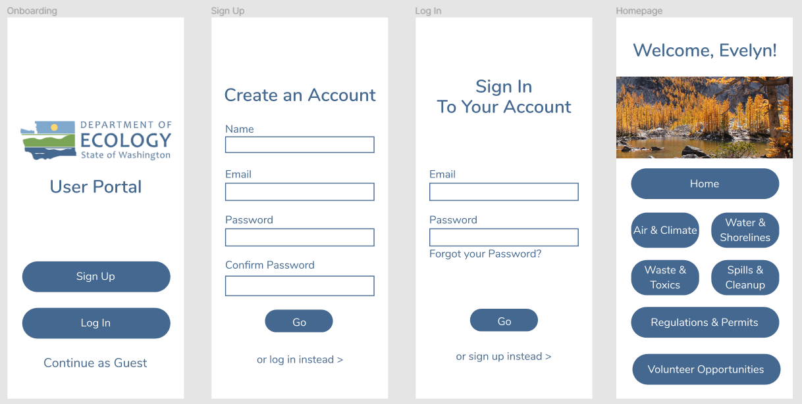  
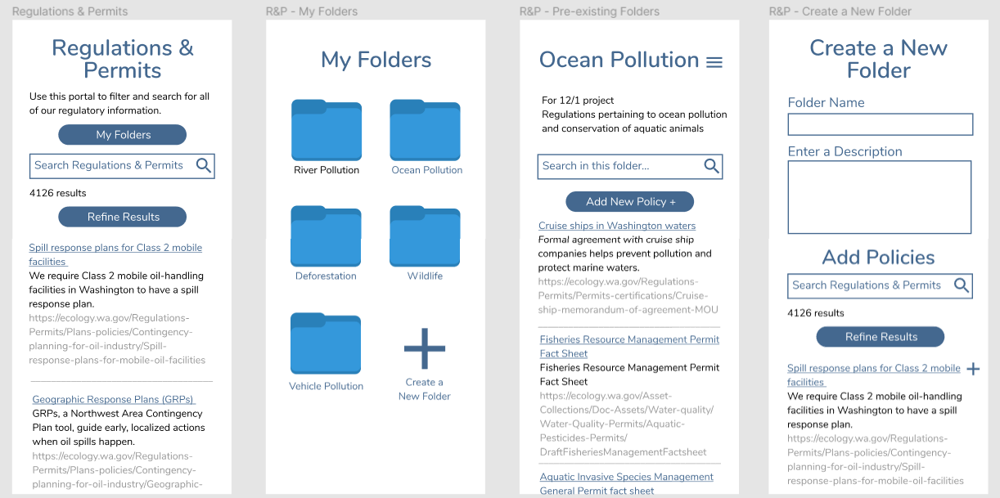  
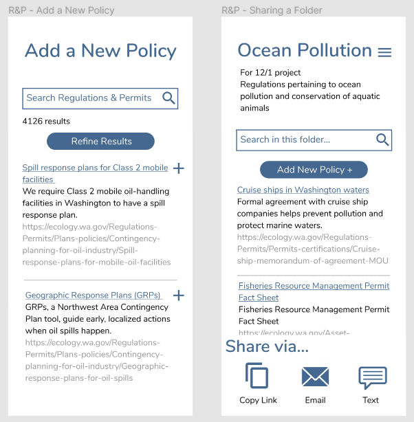  

Dark Mode  
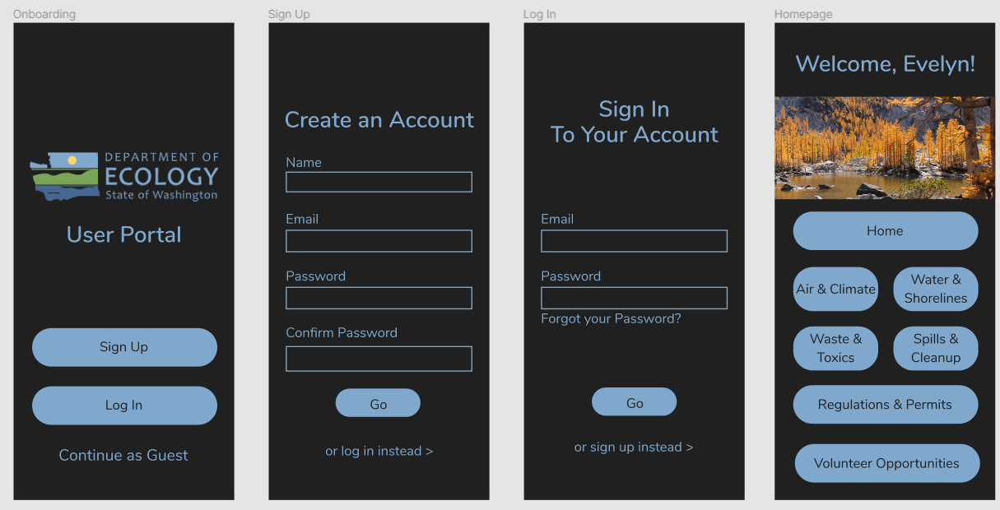  
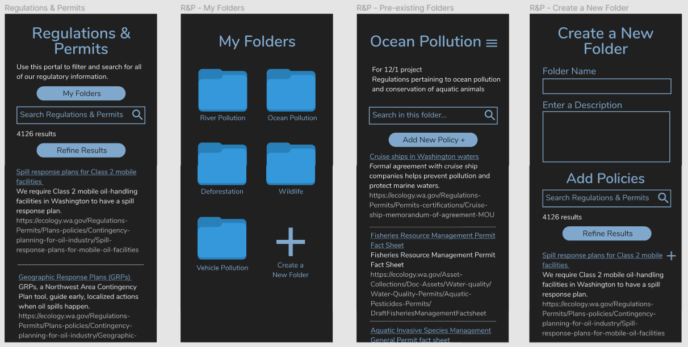  
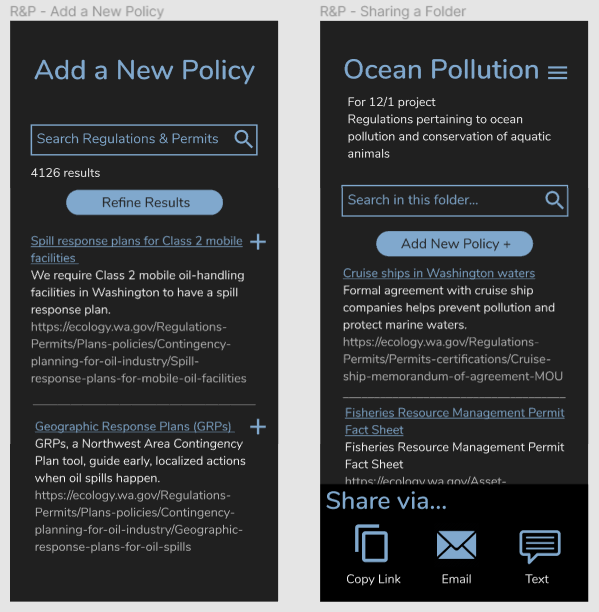  

### 1. Layout
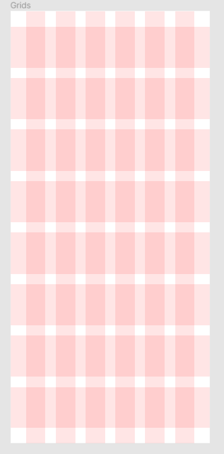

### 2. System Design
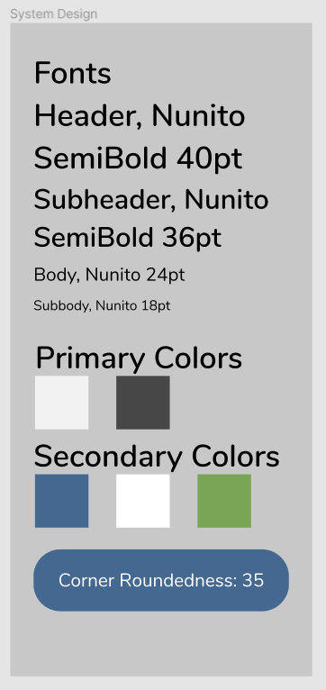
### 3. Accessibility
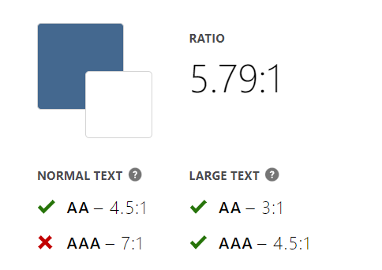 
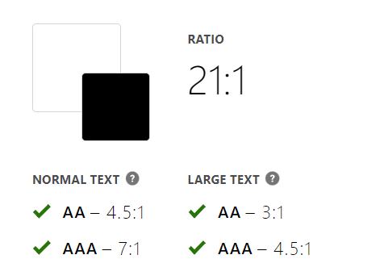 
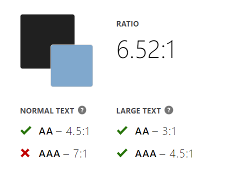 

### 4. User Impression

## Conclusion
